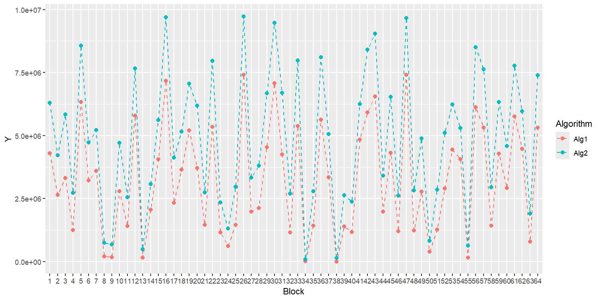
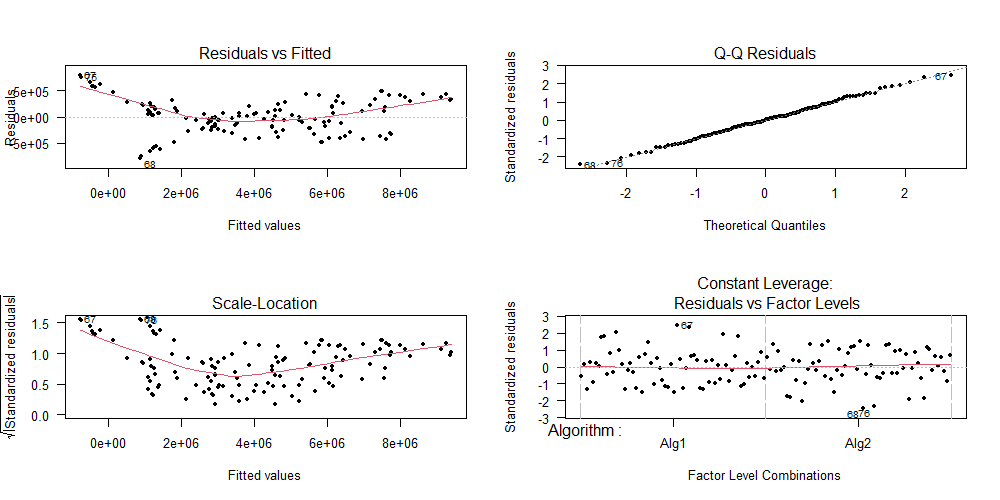
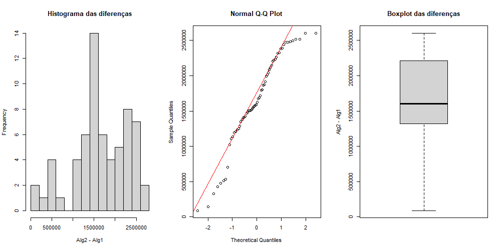

```{r setup, results='hide', warning=FALSE, echo=FALSE, message=FALSE}
knitr::opts_chunk$set(echo = TRUE)
knit_global <- TRUE

if (!require("readr")) install.packages("readr", repos="http://cran.r-project.org")
if (!require("dplyr")) install.packages("dplyr", repos="http://cran.r-project.org")
if (!require("tidyr")) install.packages("tidyr", repos="http://cran.r-project.org")
if (!require("car")) install.packages("car", repos="http://cran.r-project.org")
if (!require("dunn.test")) install.packages("dunn.test", repos="http://cran.r-project.org")
if (!require("knitr")) install.packages("knitr", repos="http://cran.r-project.org")
if (!require("multcomp")) install.packages("multcomp", repos="http://cran.r-project.org")
if (!require("ggplot2")) install.packages("ggplot2")
if (!require("pwr")) install.packages("pwr")

library(readr)
library(dplyr)
library(tidyr)
library(car)
library(dunn.test)
library(knitr)
library(multcomp)
library(ggplot2)
library(pwr)

plot_tukey_CI <- function(tukey_confint_obj,
                                      comp_significativas = NULL,
                                      comp_marginais = NULL,
                                      titulo = NULL) {
  
  # --- PASSO 1: Extrair os dados para um data.frame ---
  df_plot <- data.frame(
    Comparacao = names(tukey_confint_obj$confint[, "Estimate"]),
    Estimativa = tukey_confint_obj$confint[, "Estimate"],
    Limite_Inferior = tukey_confint_obj$confint[, "lwr"],
    Limite_Superior = tukey_confint_obj$confint[, "upr"]
  )
  
  # --- PASSO 2: Criar a coluna de destaque com base nos parâmetros ---
  df_plot <- df_plot %>%
    mutate(
      Destaque = case_when(
        Comparacao %in% comp_significativas ~ "Significativo",
        Comparacao %in% comp_marginais    ~ "Marginalmente Significativo",
        TRUE                              ~ "Não Significativo"
      )
    )
  
  # --- PASSO 3: Gerar título dinâmico se nenhum for fornecido ---
  if (is.null(titulo)) {
    nivel_confianca <- attr(tukey_confint_obj, "conf.level") * 100
    titulo_plot <- paste0("Intervalos de Confiança de 95% para Comparações Múltiplas (Tukey)")
  } else {
    titulo_plot <- titulo
  }
  
  # --- PASSO 4: Gerar o gráfico ---
  g <- ggplot(df_plot, aes(x = Estimativa, y = Comparacao, color = Destaque)) +
    geom_errorbarh(aes(xmin = Limite_Inferior, xmax = Limite_Superior), height = 0.2, size = 0.8) +
    geom_point(size = 3) +
    geom_vline(xintercept = 0, linetype = "dashed", color = "black") +
    scale_color_manual(
      name = "Nível de Significância",
      breaks = c("Significativo", "Marginalmente Significativo", "Não Significativo"),
      values = c(
        "Significativo" = "red",
        "Marginalmente Significativo" = "darkorange",
        "Não Significativo" = "gray50"
      ),
      drop = FALSE
    ) +
    labs(
      title = titulo_plot,
      x = "Diferença Estimada nos Retornos Médios",
      y = "Comparação Par a Par"
    ) +
    theme_bw() +
    theme(legend.position = "bottom")
  return(g)
}
```

```{r, eval=F, echo=FALSE}
install.packages("devtools")                    # you only have to install it once
library(devtools)
install_github("rstudio/rmarkdown")             # you only have to install it once
library(rmarkdown)
render("report_template.Rmd","pdf_document")    # this renders the pdf
```


## 1. Introdução

Algoritmos evolucionários constituem uma ampla classe de métodos de otimização inspirados nos princípios da Teoria da Evolução de Charles Darwin. Esses métodos utilizam o conceito de população de soluções candidatas, na qual cada indivíduo representa uma possível resposta para o problema de otimização considerado. A aptidão de cada indivíduo é avaliada por meio de uma função objetivo, que quantifica a qualidade da solução proposta. A partir dessa avaliação, mecanismos análogos aos processos biológicos — como seleção, recombinação (ou reprodução) e mutação — são aplicados para promover a evolução da população ao longo das iterações, com o objetivo de explorar e refinar progressivamente o espaço de busca em direção ao ponto ótimo global.

Dentre os métodos que compõem essa família, destaca-se o algoritmo de Evolução Diferencial (Differential Evolution – DE), proposto por Storn e Price (1997). O DE tem se mostrado uma abordagem particularmente eficaz para problemas de otimização contínua, combinando simplicidade de implementação com forte capacidade exploratória. Seu funcionamento baseia-se na geração iterativa de novas soluções a partir de combinações lineares de vetores da população, controladas por parâmetros que determinam a intensidade da mutação e a taxa de recombinação. A seleção, por sua vez, garante a sobrevivência das soluções mais promissoras, permitindo um equilíbrio entre exploração e explotação do espaço de busca.

Neste estudo de caso, investiga-se o impacto de diferentes configurações do algoritmo de Evolução Diferencial sobre o desempenho do método em uma determinada classe de problemas de otimização. Dessa forma, torna-se possível determinar, em caso de diferença estatística, a melhor configuração em termos de desempenho médio e qual a magnitude das diferenças encontradas, resultando na recomendação de uma frente a outra.

Os códigos implementados para realização do presente estudo de caso estão disponíveis no [repositório do GitHub do grupo.](https://github.com/Isaac-CI/EEE933-E/tree/EC3/EC3)

## 2. Metodologia

### 2.1 Formulação das Hipóteses e Planejamento Experimental

O primeiro passo da análise consistiu na definição das hipóteses do teste. A hipótese nula foi formulada como a ausência de diferença significativa no desempenho dos métodos nas duas configurações, enquanto a hipótese alternativa representa a existência de tal diferença, conforme descrito abaixo:

$$
\begin{cases}
H_0:\hat{\mu}_{config_1} = \hat{\mu}_{config_2}\\
H_1:\hat{\mu}_{config_1} \neq \hat{\mu}_{config_2}
\end{cases}
$$

Para a avaliação dessas hipóteses, adotou-se uma técnica de planejamento experimental baseada em blocagem aleatória, em conjunto com a ANOVA. O objetivo do experimento é isolar o efeito dos modelos sobre o desempenho, porém reconhece-se a existência de fatores externos que também influenciam os resultados — como a complexidade e a especificidade das instâncias utilizadas. A blocagem permite controlar essa variabilidade não controlada, separando-a da variação de interesse e, assim, aumentando a precisão e o poder estatístico do teste.

### 2.2 Tamanhos Amostrais

Para determinar o tamanho amostral necessário, foram utilizadas as especificações fornecidas no enunciado do estudo de caso:

- diferença mínima de importância prática (padronizada) $d^* = \delta^* / \sigma = 0.5$.

- nível de significância desejado $\alpha = 0.05$.

- poder estatístico mínimo (para $d = d^*$) $\pi = 1 - \beta = 0.8$.

- 149 instâncias para avaliação dos modelos.

```{r, echo=TRUE, eval=TRUE}
## Definição do número de grupos e cálculo do tamanho amostral

power.anova.test(groups = 2,
                 between.var = (0.5^2 * 1^2) / 2,
                 within.var  = 1,
                 sig.level   = 0.05,
                 power       = 0.80)
# Resultado: n = 63,77 -> 64 amostras necessárias para cada algoritmo (grupo)

# Agrupamento das 149 instâncias em 64 blocos aleatórios
inst_vector <- 2:150                     # total de 149 instâncias
n_blocks <- 64                           # número de blocos determinado pelo power.anova.test()

n <- length(inst_vector)                 # 149
q <- n %/% n_blocks                      # divisão inteira: 149 / 64 = 2
r <- n %% n_blocks                       # resto: 149 mod 64 = 21

# Vetor de tamanhos: 21 blocos com 3 instâncias, 43 blocos com 2 instâncias
sizes <- c(rep(q + 1, r), rep(q, n_blocks - r))

# Embaralhamento e separação das instâncias em blocos
inst_shuffle <- sample(inst_vector)
blocos <- split(inst_shuffle, rep(1:n_blocks, times = sizes))

# Verificação (devem existir 64 blocos e total de 149 instâncias)
length(blocos)
sum(sapply(blocos, length))
# sapply(blocos, length) # Verifica o número de instâncias por bloco
```

Com base nos cálculos, foi determinado que seriam necessários 64 blocos, dos quais 21 conteriam 3 instâncias e 43 conteriam 2 instâncias, de modo que as 149 instâncias fossem distribuídas de forma equilibrada entre os blocos. O número de repetições de cada algoritmo por instância foi escolhido como 30, um valor típico aplicado nessa técnica de planejamento de experimentos.

### 2.2 Instâncias de Teste e Configurações dos Modelos

Com o planejamento experimental definido e os parâmetros da blocagem calculados, foram geradas funções de Rosenbrock com dimensões variando de 2 a 150. Cada uma dessas funções representa uma instância independente do problema, utilizada para avaliar o desempenho dos algoritmos de otimização em diferentes níveis de complexidade.

A função de Rosenbrock é uma escolha clássica nesse tipo de experimento, pois apresenta uma superfície de busca desafiadora — um vale curvo e estreito — que dificulta a convergência dos algoritmos para o mínimo global. Essa característica torna possível observar diferenças sutis de desempenho entre os métodos, especialmente no que diz respeito à exploração e à capacidade de convergência.

```{r, echo=TRUE, eval=FALSE}

## Gerando funcoes de Rosenbrock de dimensão de 2 a 150

suppressWarnings(suppressPackageStartupMessages(library(smoof)))

instancias <- list()

for (dim in 2:150){
  fn <- local({ 
    d <- dim 
    function(X){
      if(!is.matrix(X)) X <- matrix(X, nrow = 1) # <- if a single vector is passed as X
      Y <- apply(X, MARGIN = 1,
                FUN = smoof::makeRosenbrockFunction(dimensions = d))
      return(Y)
    }
  })
  
  # parâmetros do problema
  selpars  <- list(name = "selection_standard")
  stopcrit <- list(names = "stop_maxeval", maxevals = 5000 * dim, maxiter = 100 * dim)
  probpars <- list(name = "fn", xmin = rep(-5, dim), xmax = rep(10, dim))
  popsize  <- 5 * dim 
  
  
  # salva a função como uma instância na lista
  instancias[[paste0("dim_", dim)]] <- list(
    fn       = fn,
    selpars  = selpars,
    stopcrit = stopcrit,
    probpars = probpars,
    popsize  = popsize
  )
}

```

Em seguida, foram definidas as duas configurações dos modelos a serem comparadas. Cada configuração representa uma variação dos operadores de recombinação e mutação de um algoritmo evolutivo do tipo Differential Evolution (DE), permitindo avaliar como diferentes estratégias de busca afetam o desempenho.

A Configuração 1 utiliza o operador de recombinação `recombination_lbga` e a mutação randômica com fator de amplificação `f = 4.5`, privilegiando a exploração do espaço de busca e maior diversidade populacional. Por outro lado, a Configuração 2 emprega o operador `recombination_blxAlphaBeta`, com parâmetros `alpha = 0.1` e `beta = 0.4`, aliado a uma mutação mais conservadora (`f = 3`), buscando um equilíbrio entre exploração e intensificação.

```{r, echo=TRUE, eval=FALSE}
## Ajuste de Parâmetros das configurações dos algoritmos

## Config 1
recpars1 <- list(name = "recombination_lbga")
mutpars1 <- list(name = "mutation_rand", f = 4.5)

## Config 2
recpars2 <- list(name = "recombination_blxAlphaBeta", alpha = 0.1, beta = 0.4)
mutpars2 <- list(name = "mutation_rand", f = 3)
```

Para a execução das simulações, foi desenvolvida uma função auxiliar denominada `run_one()`, responsável por rodar uma combinação específica de algoritmo × instância × replicação. Essa função configura automaticamente os parâmetros da instância, aplica o algoritmo com a configuração desejada e retorna o valor de desempenho final (`Fbest`). Dessa forma, o processo de execução torna-se sistemático e reprodutível, garantindo consistência entre as repetições experimentais.

```{r, echo=TRUE, eval=FALSE}
## Definicao funcao para rodar uma combinação (algoritmo × instância × replicação)

suppressPackageStartupMessages(library(ExpDE))

run_one <- function(alg_label, inst, seed = NULL, mutpars, recpars){
  if(!is.null(seed)) set.seed(seed)
  
  # Le os parâmetros da instância
  selpars  <- inst$selpars
  stopcrit <- inst$stopcrit
  probpars <- inst$probpars
  popsize  <- inst$popsize
  
  # Disponibiliza a função objetivo com o nome 'fn' no GlobalEnv
  assign("fn", inst$fn, envir = .GlobalEnv)
  
  # Executa o algoritmo
  out <- ExpDE(mutpars = mutpars,
               recpars = recpars,
               popsize = popsize,
               selpars = selpars,
               stopcrit = stopcrit,
               probpars = probpars,
               showpars = list(show.iters = "none"))
  
  # Extrai o valor de interesse
  data.frame(Algorithm = alg_label, Result = out$Fbest)
}
```

### 2.3 Geração e Formatação dos Dados

Com as instâncias e configurações definidas, iniciou-se a etapa de execução experimental e coleta de resultados. Para cada bloco gerado anteriormente, os dois algoritmos foram avaliados em instâncias distintas de diferentes dimensões. Cada combinação algoritmo–bloco foi executada 30 vezes a fim de capturar a variabilidade estocástica inerente aos métodos evolutivos e permitir uma análise estatística mais robusta.

Durante o processo, foram exibidas barras de progresso externas e internas, indicando o avanço dos blocos e das replicações, respectivamente. Ao final de cada bloco, foi calculada a média do desempenho dos algoritmos, armazenada em uma lista de resultados consolidada.

Esses dados foram posteriormente formatados e salvos em um arquivo `.csv`, contendo as seguintes informações: número do bloco, instância sorteada, replicação, algoritmo e valor de desempenho obtido (`Y`). Esse arquivo constitui a base para as análises estatísticas subsequentes.

```{r, echo=TRUE, eval=FALSE}
## Gerando dados - rodando os dois algoritmos nos grupos de instancias do problema


# Replicações por algoritmo x grupo
n_runs <- 30


## Loop principal sobre as instâncias (dimensões 2..150)

res_list <- list()
idx <- 1
raw_results <- data.frame()

pb_outer <- txtProgressBar(min = 0, max = length(blocos), style = 3)

for(b in seq_along(blocos)){
  
  dims_bloco <- blocos[[b]]
  
  resultados_A1 <- c()
  resultados_A2 <- c()
  
  # barra progresso
  pb_inner <- txtProgressBar(min = 0, max = n_runs, style = 3)
  cat(sprintf("\nBloco %d/%d | instâncias no bloco: %s\n",
              b, length(blocos), paste(dims_bloco, collapse=", ")))
  flush.console()
    
  for(r in 1:n_runs){
    
    # SORTEIA UMA INSTÂNCIA do bloco para esta repetição
    d <- sample(dims_bloco, 1)
    
    inst <- instancias[[paste0("dim_", d)]]
    
    # Algoritmo 1
    a1 <- run_one(alg_label = "Alg1",
                  inst = inst,
                  seed = NULL,             
                  mutpars = mutpars1,
                  recpars = recpars1)
    
    # Algoritmo 2
    a2 <- run_one(alg_label = "Alg2",
                  inst = inst,
                  seed = NULL,             
                  mutpars = mutpars2,
                  recpars = recpars2)
    
    resultados_A1 <- c(resultados_A1, a1$Result)
    resultados_A2 <- c(resultados_A2, a2$Result)
    raw_results <- rbind(raw_results,
      data.frame(Block = b, Instancia = d, Rep = r, Algorithm="Alg1", Y = a1$Result),
      data.frame(Block = b, Instancia = d, Rep = r, Algorithm="Alg2", Y = a2$Result))
  
    setTxtProgressBar(pb_inner, r)
    flush.console()
    
  }
  
  close(pb_inner)
  
  # salva a média do bloco
  res_list[[idx]] <- data.frame(Block=b, Algorithm="Alg1", Y=mean(resultados_A1)) 
  idx <- idx + 1
  res_list[[idx]] <- data.frame(Block=b, Algorithm="Alg2", Y=mean(resultados_A2))
  idx <- idx + 1
  
  setTxtProgressBar(pb_outer, b)
  flush.console()
  
}

close(pb_outer)

## Formatando dados gerados

# Caso já exista o arquivo e deseje le-lo
data <- read.table("resultados_rosenbrock.csv",
                   header = TRUE)

# Data final no formato: Block | Algorithm | Mean
data <- do.call(rbind, res_list)


# Ordenar colunas
data$Algorithm <- factor(data$Algorithm, levels = c("Alg1", "Alg2"))
data$Block     <- factor(data$Block, levels = as.character(1:n_blocks))

# Salvar no arquivo .csv
write.csv(data, "resultados_rosenbrock_medias.csv", row.names = FALSE)
write.csv(raw_results, "resultados_rosenbrock_raw.csv", row.names = FALSE)
```

```{r, echo=TRUE, eval=TRUE}
head(data)

aggdata <- data
summary(aggdata)
```

## 3 Resultados e discussão

### 3.1 Análise dos Dados

Com os resultados obtidos nas simulações, foi possível visualizar o desempenho de cada um dos modelos por bloco, como pode ser visto abaixo.

```{r echo=TRUE, eval=FALSE}
## Analise exploratoria dos dados

library(ggplot2)

# Plot grafico de comparacao do algoritmo para todos os pontos
p <- ggplot(aggdata, aes(x = Block, 
                         y = Y, 
                         group = Algorithm, 
                         colour = Algorithm))
p + geom_line(linetype=2) + geom_point(size=2)
```
```{r fig-external, echo=FALSE, out.width="80%", fig.align="center", fig.cap="Visualização de desempenho entre os algoritmos."}

```

De maneira geral, ambos os algoritmos apresentaram comportamentos oscilatórios ao longo dos blocos, o que indica que o desempenho varia significativamente entre diferentes instâncias do problema. No entanto, é possível identificar algumas tendências:

- As curvas de ambos os algoritmos apresentam padrões semelhantes, sugerindo que os dois métodos respondem de forma parecida às variações entre blocos.

- O Alg1 (em vermelho) tende a alcançar pontos das funções ligeiramente inferiores em diversos blocos, indicando uma possível vantagem média sobre o Alg2 (em azul).

- Apesar disso, a amplitude de variação de ambos os algoritmos é alta, o que pode indicar instabilidade ou sensibilidade às condições de cada bloco.

Assim, a análise gráfica preliminar sugere que o Alg1 pode ser mais eficiente em média, mas uma avaliação estatística mais detalhada é necessária para confirmar se essa diferença é significativa.

### 3.2 Blocagem + ANOVA

Para avaliar estatisticamente a diferença de desempenho entre os algoritmos, utilizou-se a ANOVA com blocagem, que permite analisar o efeito do fator experimental (os algoritmos, $\tau$) enquanto se controlam as variações específicas das instâncias (fator bloqueado, $\beta$). O modelo considera a contribuição de cada fator na resposta de acordo com a seguinte formulação:  

$$
y_{ij} = \mu + \tau_i + \beta_j +\epsilon_{ij}
\begin{cases}
i=1, \dots, a \\
j=1, \dots, b
\end{cases}
\;\;\; , \epsilon_{ij} \sim \mathcal{N}(0, \sigma^2)
$$
onde $a$ e $b$ representam, respectivamente, o número de níveis do fator experimental e do fator bloqueado.  

A estatística de teste $F$ permite verificar a influência de cada fator na variabilidade observada. Quando calculada para o fator experimental, indica se há diferença significativa de desempenho entre os algoritmos; quando calculada para o fator bloqueante, indica se a blocagem foi eficaz na redução da variabilidade causada pelas peculiaridades das instâncias. A estatística $F_0$ é obtida a partir dos quadrados médios (Mean Squares, $MS$) associados aos fatores e ao erro experimental:

$$
F_{0_\tau}=\frac{MS_\tau}{MS_E} \quad \quad e \quad \quad F_{0_\beta}=\frac{MS_\beta}{MS_E}
$$
Um valor crítico de $F_{0_\tau}$ indica diferença significativa entre os algoritmos, enquanto um valor crítico de $F_{0_\beta}$ confirma que a blocagem conseguiu reduzir a variabilidade atribuível às instâncias, aumentando a sensibilidade do teste para detectar diferenças reais de desempenho.

Ao verificar o resultado do modelo ANOVA com blocagem, exposto abaixo, observa-se que a estatística $F$ associada a ambos os fatores encontra-se na região crítica, com *p*-valores extremamente baixos. Isso indica que há diferenças estatisticamente significativas entre os desempenhos dos algoritmos, enquanto a blocagem se mostrou eficaz ao controlar a variabilidade causada pelas diferentes instâncias.  

Além disso, o modelo apresenta um coeficiente de determinação ($R^2$) elevado, de 0,984, indicando que a maior parte da variabilidade observada nos dados foi explicada pelo modelo. Portanto, o ajuste é muito bom, confirmando que a ANOVA com blocagem é adequada para analisar diferenças de desempenho entre algoritmos em diferentes instâncias.

Os resultados detalhados do modelo são apresentados a seguir:
```{r, echo=TRUE, eval=TRUE}
## Modelagem estatistica

model <- aov(Y~Algorithm+Block,
             data = aggdata)

summary(model)
summary.lm(model)$r.squared
```

Para analisar mais profundamente o impacto da blocagem, pode-se calcular a eficiência da blocagem, que mede quanto da variabilidade total atribuível aos blocos foi eliminada ao incluir o fator bloqueante no modelo. A eficiência é dada pela seguinte expressão:

$$
E_\text{blocagem} = \frac{(b-1) \, MS_\beta + b \, (a-1) \, MS_E}{(a \, b - 1) \, MS_E}
$$

onde $MS_\text{bloco}$ é o quadrado médio dos blocos, $MS_E$ é o quadrado médio do erro, $a$ é o número de níveis do fator experimental (algoritmos) e $b$ é o número de níveis do fator bloqueante (instâncias).  

Aplicando os valores do nosso experimento, obtivemos um valor de aproximadamente 28.
 
```{r, echo=TRUE, eval=TRUE}
# Eficiencia da blocagem
mydf        <- as.data.frame(summary(model)[[1]])
MSblocks    <- mydf["Block","Mean Sq"]
MSe         <- mydf["Residuals","Mean Sq"]
a           <- length(unique(aggdata$Algorithm))
b           <- length(unique(aggdata$Block))
((b - 1) * MSblocks + b * (a - 1) * MSe) / ((a * b - 1) * MSe)
```

Esse valor indica que a blocagem foi altamente eficaz, pois grande parte da variabilidade nos resultados causada pelas diferenças entre as instâncias foi controlada, aumentando a sensibilidade do teste ANOVA para detectar diferenças reais de desempenho entre os algoritmos.

### 3.3 Validação das Premissas do Modelo

O teste ANOVA é paramétrico e, portanto, é necessário verificar algumas premissas fundamentais para garantir a validade dos resultados. As principais premissas são anormalidade dos resíduose a homocedasticidade (variância constante dos erros).

#### 3.3.1 Normalidade dos Resíduos:

A forma mais padrão para verificação de normalidade é através do teste de *Shapiro–Wilk*, que avalia a hipótese nula de que os resíduos seguem uma distribuição normal. Valores do *p*-valor acima do nível de significância (geralmente 0,05) indicam que não há evidências suficientes para rejeitar a normalidade.

No caso em análise, o teste de *Shapiro–Wilk* apresentou W = 0.99622 e *p*-value = 0.9841, o que é muito superior a 0,05. Assim, não rejeita-se a hipótese nula, concluindo-se que os resíduos seguem uma distribuição aproximadamente normal.

```{r, echo=TRUE, eval=TRUE}
## Validacao de Premissas e Teste Pareado

res <- residuals(model)

# Shapiro - normalidade dos residuos
shapiro.test(res)
```

A normalidade dos resíduos também pode ser avaliada visualmente por meio de gráficos diagnósticos, como o Q-Q plot e os gráficos de resíduos vs. valores ajustados, conforme mostrado abaixo:

```{r, echo=TRUE, eval=FALSE}
# Testes gráficos para ver normalidade e independência
par(mfrow = c(2, 2))
plot(model, pch = 20, las = 1)
```
```{r fig-external2, echo=FALSE, out.width="80%", fig.align="center", fig.cap="Testes gráficos para ver normalidade e independência."}

```

Na figura acima, o Q-Q plot mostra que a maior parte dos resíduos segue aproximadamente a linha teórica, indicando que não há grandes desvios da normalidade. Alguns pontos extremos (outliers) estão presentes, mas não comprometem significativamente o modelo, considerando o tamanho da amostra. Além disso, os gráficos de resíduos vs. valores ajustados e resíduos vs. níveis do fator Algorithm não mostram padrões sistemáticos claros, o que reforça a hipótese de que os resíduos podem ser considerados normalmente distribuídos. Dessa forma, a premissa de normalidade dos resíduos é aceitável, permitindo a aplicação do teste ANOVA com blocagem de forma confiável.

#### 3.3.2 Homogeneidade de Variâncias (Homocedasticidade):

A homocedasticidade, ou seja, a constância da variância dos resíduos ao longo dos valores ajustados e entre os níveis dos fatores, é uma premissa fundamental para a validade do teste ANOVA. O gráfico Scale-Location (raiz do valor absoluto dos resíduos padronizados vs. valores ajustados), apresentado acima, mostra uma leve curva, sugerindo que a variância dos resíduos não é perfeitamente constante. No entanto, a dispersão geral dos pontos é relativamente uniforme, sem grandes agrupamentos ou tendências abruptas. Isso indica que a heterocedasticidade, se presente, é moderada.

O gráfico Residuals vs Factor Levels reforça essa conclusão, mostrando que os resíduos padronizados estão distribuídos de forma similar entre os níveis do fator Algorithm, sem diferenças significativas de dispersão entre Alg1 e Alg2. Não há evidência clara de violação grave da premissa de homocedasticidade. Portanto, podemos considerar que a variância dos resíduos é aproximadamente constante, permitindo a aplicação do teste ANOVA de maneira confiável. Em caso de incerteza, métodos de correção ou transformações poderiam ser considerados, mas, visualmente, os resíduos apresentam comportamento aceitável para a análise.

Para verificar a homocedasticidade de forma quantitativa, pode-se realizar o teste de *Fligner-Killeen*. O *p*-valor encontrado foi de 0.9705, muito maior que 0.05, não sendo capaz, portanto, de rejeitar a hipótese de homocedasticidade.

```{r, echo=TRUE, eval=TRUE}
fligner.test(res ~ group)
```

### 3.4 Tamanho do Efeito

Nesta etapa, buscou-se confirmar o resultado obtido com o modelo ANOVA por meio de uma análise complementar bloco a bloco, utilizando um teste pareado e o cálculo do tamanho do efeito (Cohen’s d). O objetivo é avaliar se, de forma consistente entre os blocos, há diferença significativa e relevante entre os algoritmos.

#### 3.4.1 Teste Pareado:

Cada bloco representa um conjunto de observações em condições semelhantes, permitindo comparar diretamente o desempenho dos dois algoritmos.  
Para cada bloco $j$, foi calculada a diferença:

$$
d_j = Y_{\text{Alg2}, j} - Y_{\text{Alg1}, j}, \quad j = 1, 2, \ldots, b
$$

onde \( b \) é o número total de blocos.

```{r, echo=TRUE, eval=TRUE}
# Diferenças por grupo (par por dimensão)
wide <- reshape(aggdata, idvar="Block", timevar="Algorithm", direction="wide")
wide$diff <- wide$Y.Alg2 - wide$Y.Alg1
```

As hipóteses testadas são:

$$
\begin{cases}
H_0: \mu_d = 0 \quad \text{(não há diferença significativa entre os algoritmos)} \\
H_1: \mu_d \neq 0 \quad \text{(há diferença significativa entre os algoritmos)}
\end{cases}
$$
Antes de escolher o teste adequado, foi realizada uma análise visual das diferenças de desempenho dos algoritmos em cada bloco. Observando a figura abaixo fica evidente que a distribuição das diferenças de desempenho por grupo entre os algoritmos não segue uma distribuição normal, com caudas não simétricas e mais pesadas que o normal.

```{r, echo=TRUE, eval=FALSE}
par(mfrow = c(1,3))
hist(wide$diff, breaks = 15, main = "Histograma das diferenças", xlab = "Alg2 - Alg1")
qqnorm(wide$diff); qqline(wide$diff, col = "red")
boxplot(wide$diff, main = "Boxplot das diferenças", ylab = "Alg2 - Alg1")
par(mfrow = c(1,1))
```
```{r fig-external3, echo=FALSE, out.width="80%", fig.align="center", fig.cap="Visualização das diferenças de desempenho intra-blocos."}

```

Ademais, também foi utilizando o teste de Shapiro–Wilk, cujo resultado foi de que há evidência suficiente para rejeitar a hipótese de normalidade das diferenças intra-bloco (*p*-valor aproximadamente 0.008).

```{r, echo=TRUE, eval=TRUE}
# Shapiro - normalidade das diferenças pareadas por grupo
shapiro.test(wide$diff)
```

Portanto, aplicou-se o teste de Wilcoxon pareado, que não depende da suposição de normalidade. O resultado foi um *p*-valor extremamente baixo, que indica uma diferença estatisticamente significativa entre os algoritmos, com alta evidência de que um deles (Alg1) apresenta desempenho superior em relação ao outro (Alg2) de forma consistente entre os blocos.

```{r, echo=TRUE, eval=TRUE}
# Teste pareado para as diferenças (caso normalidade NOK)
wilcox.test(wide$Y.Alg2, wide$Y.Alg1, paired = TRUE)
```

#### 3.4.2 Cálculo do Tamanho do Efeito:

Embora o teste de Wilcoxon indique significância estatística, é importante quantificar a magnitude prática dessa diferença.  
Para isso, calculou-se o índice de Cohen’s d, definido por:

$$
d = \frac{\bar{d}}{s_d}
$$

onde:

- $\bar{d}$ é a média das diferenças entre os algoritmos;  
- $s_d$ é o desvio padrão das diferenças.

Esse índice expressa quão grande é a diferença entre os algoritmos em relação à variabilidade observada. O resultado $d = 2.55$ representa um efeito extremamente grande, evidenciando que a diferença observada entre os algoritmos é não apenas estatisticamente significativa, mas também muito relevante em termos práticos. Como o valor médio do Alg1 foi inferior ao do Alg2, o efeito é favorável ao Alg1. 

```{r, echo=TRUE, eval=TRUE}
#Tamanho do efeito
diff_mean <- mean(wide$diff)
diff_sd   <- sd(wide$diff)
cohen_d <- diff_mean / diff_sd
cohen_d
```

## 4. Conclusões

Os resultados obtidos neste estudo de caso demonstraram de forma clara a eficácia da aplicação conjunta da técnica de blocagem e da análise de variância (ANOVA) na comparação de diferentes configurações do algoritmo de Evolução Diferencial (DE). A blocagem mostrou-se altamente eficiente — com um índice de eficiência próximo a 28 —, evidenciando que grande parte da variabilidade entre as instâncias foi controlada, o que aumentou a sensibilidade do teste estatístico.

O modelo ANOVA indicou diferenças altamente significativas entre as configurações avaliadas ($p < 2e−16$), confirmando que os algoritmos apresentam desempenhos distintos. Além disso, o coeficiente de determinação ($R^2 = 0.984$) reforça a adequação do modelo, uma vez que quase toda a variabilidade observada pôde ser explicada pelos fatores considerados.

A validação das premissas do modelo mostrou que os resíduos seguem uma distribuição aproximadamente normal e que não há evidências de heterocedasticidade significativa, sustentando a confiabilidade dos resultados. Em complemento, a análise pareada intra-blocos — necessária por se tratar de uma comparação direta entre apenas dois algoritmos — reforçou as conclusões do modelo. O teste de Shapiro–Wilk rejeitou a normalidade das diferenças (p = 0.0083), levando à aplicação do teste não paramétrico de Wilcoxon, que retornou um p-valor extremamente baixo ($p \approx 3.61×10^{-12}$), evidenciando uma diferença estatisticamente significativa entre os algoritmos.

Por fim, o cálculo do tamanho do efeito (Cohen’s d = 2.55) mostrou que essa diferença é não apenas estatisticamente relevante, mas também de magnitude muito elevada. Considerando que, neste problema de minimização, menores valores de desempenho representam melhores resultados, conclui-se que o Algoritmo 1 (Alg1) supera de forma consistente o Algoritmo 2 (Alg2) em praticamente todos os blocos.

Em suma, os resultados apontam que a configuração Alg1 é a mais eficiente, apresentando desempenho significativamente melhor e efeito prático expressivo. Assim, recomenda-se a adoção dessa configuração em experimentos futuros que envolvam problemas de natureza semelhante.


## Apendice A - Funções dos integrantes
- Stéfani: Responsável pelo projeto e implementação do estudo de caso, esboçar o relatório e discutir a realização do estudo, bem como seus resultados;
- Homero: Responsável por discutir a realização do estudo, bem como seus resultados, redigir o texto completo completando e incrementando o esboço;
- Isaac: Responsável por discutir a realização do estudo, bem como seus resultados, revisar e complementar o relatório e redigir a versão final.
